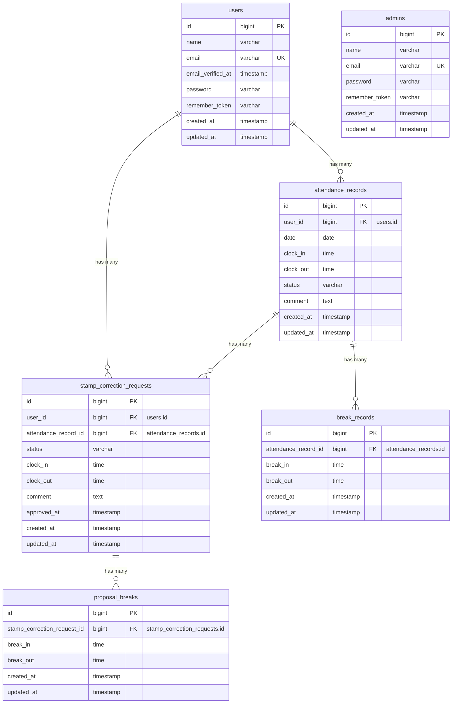

# 勤怠管理システム

スタッフの出退勤・休憩打刻および勤怠修正申請を行えるLaravelプロジェクトです。一般ユーザー（スタッフ）の打刻・申請機能と、管理者による勤怠確認・修正申請の承認機能を備えています。

## 作成者

太田優子

## 使用技術

- PHP 8.2
- Laravel 10.x
- MySQL 8.4
- Nginx
- Docker / Docker Compose / Laravel Sail
- Vite / CSS
- Laravel Fortify（認証）
- phpMyAdmin

## ER図



## 開発環境URL

- アプリケーション: http://localhost
- phpMyAdmin: http://localhost:8080

## 動作環境

- Docker
- Docker compose

    ※ Windowsの場合はWSL2の利用を推奨します。

## 環境構築手順

1. リポジトリをクローン

```bash
    git clone
```

2. .envファイルの編集

    .env ファイルを開き、データベース接続情報が以下と一致していることを確認します。

```bash
    DB_CONNECTION=mysql
    DB_HOST=mysql
    DB_PORT=3306
    DB_DATABASE=laravel
    DB_USERNAME=sail
    DB_PASSWORD=password

    MAIL_MAILER=smtp
    MAIL_HOST=mailpit
    MAIL_PORT=1025
```

3. phpMyAdmin を compose.yaml に追記

    compose.yaml を開き、mysql サービスの後に以下の設定を追加してください。

```bash
    phpmyadmin:
      image: 'phpmyadmin:latest'
      ports:
        - '${FORWARD_PHPMYADMIN_PORT:-8080}:80'
      environment:
        PMA_HOST: mysql
        PMA_USER: '${DB_USERNAME}'
        PMA_PASSWORD: '${DB_PASSWORD}'
      networks:
        - sail
      depends_on:
        - mysql
```

4. Composer依存パッケージのインストール

    プロジェクトの初回セットアップ時は、vendor ディレクトリが存在しないため sail コマンドを使用できません。 以下のDockerコマンドを実行して、コンテナ内で composer install を実行します。

```bash
    docker run --rm \
    -u "$(id -u):$(id -g)" \
    -v "$(pwd):/var/www/html" \
    -w /var/www/html \
    laravelsail/php82-composer:latest \
    composer install --ignore-platform-reqs
```

5. Laravel Sailの起動

    以下のコマンドでDockerコンテナを起動します。

```bash
    ./vendor/bin/sail up -d
```

6. エイリアスの設定（推奨）

    毎回 ./vendor/bin/sail と入力するのは手間なので、エイリアスを設定すると便利です。

```bash
    alias sail='[ -f sail ] && bash sail || bash vendor/bin/sail'
```

7. アプリケーションキーの生成

```bash
    sail artisan key:generate
```

8. データベースのマイグレーションと初期データ投入

    以下のコマンドでテーブルを作成し、ダミーデータを投入します。

```bash
    sail artisan migrate:fresh --seed
```

    ※このコマンドの実行時にアクセス拒否等のエラーが表示される場合は、コンテナ内に過去のデータが残っている可能性があります。その場合は、以下のコマンドを順に実行して各コンテナを再起動してください。

```bash
    sail down -v
    sail up -d //コマンド実行後にSQLコンテナが立ち上がるまで時間がかかります。30秒ほどお待ちください。
    sail artisan migrate:fresh --seed
```

9. フロントエンドのビルド

```bash
    sail npm install
    sail npm run dev
```

10. アプリケーションへのアクセス

    ブラウザで http://localhost にアクセスします。

## テスト実行

```bash
    sail artisan test
```

カバレッジ付きで実行する場合

```bash
    sail artisan test --coverage
```

## 機能一覧

### 一般ユーザー機能

- ユーザー登録・メール認証・ログイン・ログアウト
- 打刻機能（出勤・退勤・休憩開始・休憩終了）
- 勤務状態のステータス管理（勤務外・出勤中・休憩中・退勤済）
- 勤怠一覧表示（月次表示・前月/翌月移動）
- 勤怠詳細表示
- 勤怠修正申請機能（理由記述必須・複数休憩修正対応）
- 自身の申請一覧・状態確認（承認待ち・承認済み）

### 管理者機能

- 管理者ログイン・ログアウト
- 全スタッフの勤怠一覧表示（日別表示・日付移動）
- スタッフ一覧表示および個別スタッフの月次勤怠一覧表示
- 勤怠修正申請の承認・詳細確認機能
