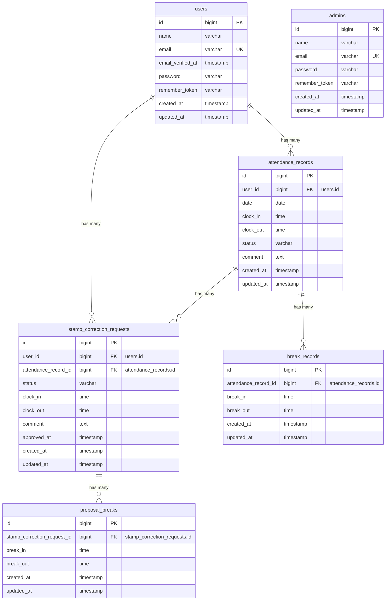

# 勤怠管理システム

スタッフの出退勤・休憩打刻および勤怠修正申請を行えるLaravelプロジェクトです。一般ユーザー（スタッフ）の打刻・申請機能と、管理者による勤怠確認・修正申請の承認機能を備えています。

## 作成者

太田優子

## 使用技術

- PHP 8.2
- Laravel 10.x
- MySQL 8.4
- Nginx
- Docker / Docker Compose / Laravel Sail
- Vite / CSS
- Laravel Fortify（認証）
- phpMyAdmin

## ER図



## 開発環境URL

- アプリケーション: http://localhost
- Mailpit (メール確認用): http://localhost:8025
- phpMyAdmin: http://localhost:8080

## 動作環境

- Docker
- Docker compose

    ※ Windowsの場合はWSL2の利用を推奨します。

## 環境構築手順

1. リポジトリをクローン

```bash
    git clone <本リポジトリのURL>
    cd <プロジェクトフォルダ名>
```

2. .envファイルの編集

    .env ファイルを開き、データベース接続情報が以下と一致していることを確認します。

```bash
    DB_CONNECTION=mysql
    DB_HOST=mysql
    DB_PORT=3306
    DB_DATABASE=laravel
    DB_USERNAME=sail
    DB_PASSWORD=password

    MAIL_MAILER=smtp
    MAIL_HOST=mailpit
    MAIL_PORT=1025
```

3. phpMyAdmin を compose.yaml に追記

    compose.yaml を開き、mysql サービスの後に以下の設定を追加してください。

```bash
    phpmyadmin:
      image: 'phpmyadmin:latest'
      ports:
        - '${FORWARD_PHPMYADMIN_PORT:-8080}:80'
      environment:
        PMA_HOST: mysql
        PMA_USER: '${DB_USERNAME}'
        PMA_PASSWORD: '${DB_PASSWORD}'
      networks:
        - sail
      depends_on:
        - mysql
```

4. Composer依存パッケージのインストール

    プロジェクトの初回セットアップ時は、vendor ディレクトリが存在しないため sail コマンドを使用できません。 以下のDockerコマンドを実行して、コンテナ内で composer install を実行します。

```bash
    docker run --rm \
    -u "$(id -u):$(id -g)" \
    -v "$(pwd):/var/www/html" \
    -w /var/www/html \
    laravelsail/php82-composer:latest \
    composer install --ignore-platform-reqs
```

5. Laravel Sailの起動

    以下のコマンドでDockerコンテナを起動します。

```bash
    ./vendor/bin/sail up -d
```

6. エイリアスの設定（推奨）

    毎回 ./vendor/bin/sail と入力するのは手間なので、エイリアスを設定すると便利です。

```bash
    alias sail='[ -f sail ] && bash sail || bash vendor/bin/sail'
```

7. アプリケーションキーの生成

```bash
    sail artisan key:generate
```

8. データベースのマイグレーションと初期データ投入

    以下のコマンドでテーブルを作成し、ダミーデータを投入します。

```bash
    sail artisan migrate:fresh --seed
```

    ※このコマンドの実行時にアクセス拒否等のエラーが表示される場合は、コンテナ内に過去のデータが残っている可能性があります。その場合は、以下のコマンドを順に実行して各コンテナを再起動してください。

```bash
    sail down -v
    sail up -d //コマンド実行後にSQLコンテナが立ち上がるまで時間がかかります。30秒ほどお待ちください。
    sail artisan migrate:fresh --seed
```

9. フロントエンドのビルド

```bash
    sail npm install
    sail npm run dev
```

10. アプリケーションへのアクセス

    ブラウザで http://localhost にアクセスします。

## ログイン情報（初期データ）

管理者ユーザー
メールアドレス：user3@example.com
パスワード：password

一般ユーザー1
メールアドレス：user1@example.com
パスワード：password

一般ユーザー2
メールアドレス：user2@example.com
パスワード：password

## テスト実行

```bash
    sail artisan test
```

カバレッジ付きで実行する場合

```bash
    sail artisan test --coverage
```

## 機能一覧

### 一般ユーザー機能

- ユーザー登録・メール認証・ログイン・ログアウト
  新規会員登録時のメール送信およびメール認証誘導機能
  未認証時のログイン制限とメール再送機能
- 打刻機能（出勤・退勤・休憩開始・休憩終了）
- 勤務状態のステータス管理（勤務外・出勤中・休憩中・退勤済）
- 勤怠一覧表示（月次表示・前月/翌月移動）
- 月次勤怠データのCSV出力機能
- 勤怠詳細表示
- 勤怠修正申請機能（理由記述必須・複数休憩修正対応）
- 自身の申請一覧・状態確認（承認待ち・承認済み）
- マイ勤怠レポート表示機能 (/attendance/report)
  基本サマリー: 過去6ヶ月の総労働時間・総残業時間・1日あたり平均労働時間
  月次推移: 過去6ヶ月の労働時間・残業時間の月別表示
  異常検知: 遅刻回数（9:00超）、早退回数（18:00未満）、長時間労働日数（10時間超）の月内集計

### 管理者機能

- 管理者ログイン・ログアウト
- 全スタッフの勤怠一覧表示（日別表示・日付移動）
- スタッフ一覧表示および個別スタッフの月次勤怠一覧表示
- 勤怠修正申請の承認・詳細確認機能

## 公開API仕様 (REST API v1)

一般ユーザー・外部連携向けに勤怠管理用 API エンドポイントを提供します。

### 基本仕様・認証

- **ベースURL:** `/api/v1/attendance-records`
- **参照系 (GET):** 認証不要
- **更新・書き込み系 (POST / PUT / DELETE):** Laravel Sanctum による Bearer Token 認証が必要 (`auth:sanctum`)
- **認可制御:** Policy (`AttendanceRecordPolicy`) により本人のみ（または管理者）が自己のデータに対して更新・削除を実行可能。他ユーザー実行時は 403 エラーを返却。

### エンドポイント一覧

| メソッド      | エンドポイント                                  | 認証 | 内容                                       |
| ------------- | ----------------------------------------------- | ---- | ------------------------------------------ |
| **GET**       | `/api/v1/attendance-records`                    | 不要 | 勤怠一覧取得（検索・ページネーション付き） |
| **GET**       | `/api/v1/attendance-records/{attendanceRecord}` | 不要 | 勤怠詳細取得                               |
| **POST**      | `/api/v1/attendance-records`                    | 要   | 勤怠新規登録                               |
| **PUT/PATCH** | `/api/v1/attendance-records/{attendanceRecord}` | 要   | 勤怠情報更新（部分更新対応）               |
| **DELETE**    | `/api/v1/attendance-records/{attendanceRecord}` | 要   | 勤怠情報削除                               |

### APIレスポンス仕様

- **エラーフォーマット:**
    - `401 Unauthenticated`: `{"message": "Unauthenticated."}`
    - `403 Forbidden`: `{"error": "この操作を実行する権限がありません。"}`
    - `404 Not Found`: `{"error": "勤怠情報が見つかりませんでした。"}`
    - `422 Unprocessable Entity`: 日本語のエラーメッセージを含む JSON (`errors` オブジェクト)
